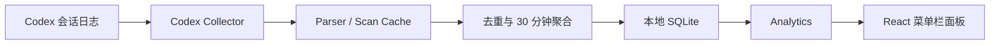

# CiroLong/amos

本地 Codex token 用量统计工具, 代码全部由Codex生成, 个人用, 持续开发中.

URL: https://github.com/CiroLong/amos

## Why it matters
You saved an article on 2026-06-23 about AI dev tools; this candidate overlaps with "sciencebanda09/nexus-multiagent" and may turn that reading into a practical workflow improvement.

## Pros
+ Recently updated (2026-07-23)
+ MIT license
+ GitHub Actions/CI detected
+ README mentions tests or validation

## Cons
- README mentions credentials or API tokens
- README mentions telemetry/analytics

## Repository Inspection
README quality: 100/100
CI detected: yes
Tests mentioned: yes
Setup steps estimate: 3

Dependency files:
- package.json: deps @tauri-apps/api, @tauri-apps/plugin-opener, lucide-react, react, react-dom, @tauri-apps/cli, @testing-library/jest-dom, @testing-library/react; scripts dev, build, preview, test, tauri

Install commands found:
- git clone https://github.com/CiroLong/amos.git
- npm install
- npm run tauri dev
- npm run tauri build
- npm test
- npm run build

Risk flags:
- README mentions credentials or API tokens
- README mentions telemetry/analytics

## Install
Nothing runs automatically. Review the upstream README before running any install command.

## README
<div align="center">
  

  # Amos

  **一个安静运行在菜单栏 / 系统托盘中的本地 Codex token 用量统计工具。**

  Local-first Codex token usage tracker for macOS and Windows.

  
  
  
  
  
  [](LICENSE)
</div>

## Amos 是什么

Amos 会读取本机 Codex Desktop / Codex CLI 的会话日志，在本地计算 token 用量和预估费用，并通过一个紧凑的菜单栏面板展示：

- 今日、最近 7 天和全部 token 用量
- 按模型价格估算的费用
- 最近一年活动热力图
- Top Models 与当前主要模型
- 扫描状态、错误和未知价格模型提示

所有统计数据都保存在本机 SQLite 中。Amos 不需要账号，也不会把日志或统计结果上传到远端。

## 特性

- **菜单栏优先**：启动后隐藏主窗口，通过 macOS 菜单栏或 Windows 系统托盘打开。
- **本地采集**：扫描 `$CODEX_HOME` 或 `~/.codex` 中的 Codex 会话记录。
- **增量解析**：支持 `.jsonl` 与 `.jsonl.zst`，可追加文件优先从上次 offset 继续解析。
- **幂等统计**：去重后聚合为 30 分钟 bucket，重复扫描不会重复累计。
- **多类 token**：分别统计 input、output、cached input、cache creation input 和 reasoning output。
- **费用估算**：内置静态模型价格表；未知模型仍保留 token，用量费用记为 0 并给出提示。
- **隐私优先**：不持久化 prompt、completion、消息正文或工具输出。
- **可扩展 collector**：采集层预留统一接口，便于后续接入更多 AI 编程工具。

## 界面

Amos 使用 `360 × 520` 的紧凑弹出面板，适合随时查看而不打断当前工作。当前面板包含用量摘要、Codex 状态卡片、年度 Activity 热力图和 Top Models。

> 截图将在后续版本补充。

## 下载

每个 GitHub Release 提供两个安装包：

- **macOS**：Universal `.dmg`，同时支持 Apple Silicon 和 Intel。
- **Windows**：x64 NSIS `-setup.exe`。

前往 [Releases](https://github.com/CiroLong/amos/releases) 下载。早期版本尚未完成 Apple notarization 和 Windows 代码签名，操作系统可能显示安全警告。

## 快速开始

### 环境要求

- Node.js 与 npm
- Rust stable toolchain
- Tauri 2 所需的平台构建环境
  - macOS：Xcode Command Line Tools
  - Windows：Microsoft C++ Build Tools 与 WebView2

### 本地运行

```bash
git clone https://github.com/CiroLong/amos.git
cd amos
npm install
npm run tauri dev
```

应用启动后不会主动弹出主窗口，请点击菜单栏或系统托盘中的 Amos 图标。

### 构建安装包

```bash
npm run tauri build
```

产物位于：

```text
src-tauri/target/release/bundle/
```

macOS 与 Windows 的完整构建要求和产物位置见 [发布构建说明](docs/release-build.md)。

跨平台安装包由 GitHub Actions 在 macOS 和 Windows runner 上分别构建。推送 `v*` tag 后会生成包含 universal DMG 和 Windows NSIS installer 的 Draft Release。

## 开发

常用命令：

```bash
# 运行前端测试
npm test

# 类型检查并构建前端
npm run build

# 运行 Rust 测试
cargo test --manifest-path src-tauri/Cargo.toml

# 启动桌面开发环境
npm run tauri dev

# 构建桌面产物
npm run tauri build
```

## 工作原理



核心模块：

| 模块 | 职责 |
| --- | --- |
| `collector/codex.rs` | 发现并解析 Codex JSONL / Zstd 日志 |
| `scanner.rs` | 调度扫描、管理增量缓存和错误隔离 |
| `aggregator.rs` | token 去重与半小时 bucket 聚合 |
| `storage.rs` | SQLite schema、缓存、幂等写入和查询 |
| `analytics.rs` | 汇总、趋势、热力图和模型排行 |
| `tray.rs` | 托盘菜单、窗口定位与失焦隐藏 |
| `SummaryPanel.tsx` | 紧凑统计面板 |

更完整的仓库约定见 [AGENTS.md](AGENTS.md)。

## 本地数据与隐私

数据库文件名为 `amos.sqlite`，由 Tauri 放置在当前操作系统的应用数据目录中。

Amos 只保存生成统计所需的数据：

- 来源、模型、项目和时间 bucket
- 各类 token 数量与预估费用
- 文件扫描位置、解析状态和去重所需的统计快照

Amos 不保存或上传：

- prompt 与 completion
- 会话消息正文
- tool 调用输入或输出
- 账号、认证信息或云端用户数据

## 当前状态

Amos 目前处于早期版本：

- 已支持 Codex Desktop / Codex CLI。
- 启动时扫描一次，也可以从面板手动刷新。
- 尚未实现周期扫描。
- 托盘菜单中的 `Refresh Now` 事件接线仍待完善。
- Pause Collection 状态仅在当前进程内有效。
- Claude Code、Cursor、AntiGravity 等 collector 尚未实现。

费用只是根据静态价格表计算的估算值，不应作为账单依据。

## Roadmap

- [ ] 定时后台扫描与完整托盘刷新流程
- [ ] 持久化应用设置和暂停状态
- [ ] 可配置的数据源与时间范围
- [ ] Claude Code、Cursor 等更多 collector
- [ ] 模型价格表更新机制
- [x] GitHub Actions 跨平台 Release 工作流
- [ ] macOS notarization 与 Windows 代码签名

## 参与开发

Issue 和 Pull Request 都欢迎。提交改动前请根据范围运行对应测试，并执行：

```bash
git diff --check
```

如果要增加新的数据来源，请实现 `UsageCollector`，不要把来源特有逻辑写入 scanner 或前端。

## License

Amos 使用 [MIT License](LICENSE) 开源。

Copyright © 2026 CiroLong.

